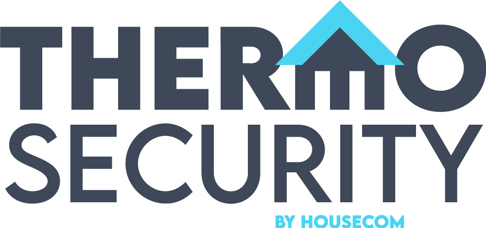

# THERMOSECURITY by Housecom - Hackathon

Welcome to THERMOSECURITY, an exciting project developed during the Housecom Hackathon. Our goal is to create an interactive application that leverages 3D, video, and still images to deliver an engaging experience for end users. This innovative project is designed as a one-page mobile-first web application.

## Installation and Setup

To get started with THERMOSECURITY, follow these simple steps:

Clone the repository to your preferred directory using the following command:

    git clone [Perruzzi_Giovanni_Ortiz_Pablo__Shah_Hiral_Hackathon]
    cd [Perruzzi_Giovanni_Ortiz_Pablo__Shah_Hiral_Hackathon]

Alternatively, you can download the app by clicking the "Code" button and selecting "Download ZIP" from the repository's GitHub page.

Run the web app in your local environment.

## How to Use the Project

After setting up the project, simply open the web app in your preferred web browser to enjoy the interactive experience it offers.

## How to Contribute

We welcome contributions from the community to make THERMOSECURITY even better. Here's how you can contribute:

Fork the repository to create your copy.

Create a new feature branch using the following command:

    git checkout -b my-new-feature

Commit your changes with a meaningful message:

    git commit -m 'Add some feature'

Push your changes to the branch you created:

    git push origin my-new-feature

Finally, submit a pull request to have your changes reviewed and integrated into the project.

We appreciate your contributions and look forward to working together!

## Credits

THERMOSECURITY is a collaborative effort, and we would like to thank the following contributors:

- [Hiral Shah](https://github.com/hiralshah7 "Personal Account")
- [Pablo Ortiz](https://github.com/ortizp978 "Personal Account")
- Giovanni Perruzzi

## License

THERMOSECURITY is released under the MIT License. Enjoy contributing and using this project!
